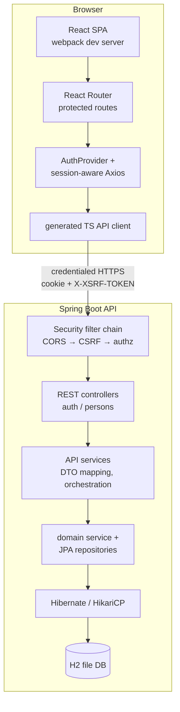
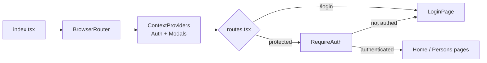
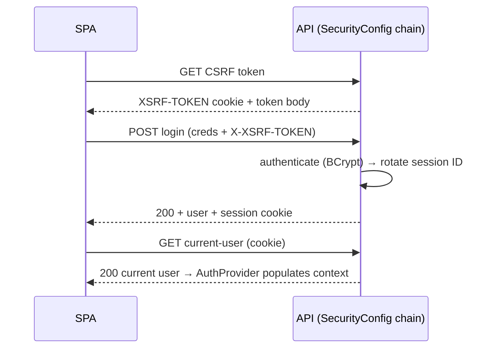

# Architecture

This document describes how `tech-demo-test` is built and why it is built that
way. It is the technical companion to the higher-level
[`PROJECT_OVERVIEW.md`](../PROJECT_OVERVIEW.md) and the operational
[`SECURITY.md`](../SECURITY.md), and it cross-references the architecture
decision records under [`docs/ADR/`](./ADR/).

`tech-demo-test` is Foundation s.r.o.'s **reference template** for new
backend + frontend projects. Its business surface is intentionally tiny —
authenticated users manage `Person` records and export a person detail as a
PDF — so that the repository's real payload is its *shape*: the preferred
application structure, dependency baseline, testing strategy, and the CI /
quality / security gate that every new project inherits. It is a **rolling
demo** on one branch (`main`), not a versioned product.

> **Scope & maintenance rule.** This document describes what is *stable* —
> structure, layering, patterns, boundaries, and decisions. It deliberately does
> **not** restate facts that change with ordinary code evolution; those are
> referenced at their authoritative source instead of copied here, so the doc
> cannot silently go stale:
>
> | Volatile fact | Lives in (authoritative source) |
> | ------------- | ------------------------------- |
> | Endpoints, request/response shapes | OpenAPI spec → `/v3/api-docs`, Swagger UI `/swagger-ui.html` |
> | Exact dependency versions | `api/pom.xml`, `ui/package.json` (+ README stack snapshot) |
> | Authorization matrix | `SecurityConfig` + [`SECURITY.md`](../SECURITY.md) |
> | DB schema / migrations | `api/src/main/resources/db/migration/` |
> | Tunable config values | `api/src/main/resources/application*.properties` |
>
> When you add a section, prefer a one-line reference over a copied table if the
> underlying fact is generated or changes per commit.

---

## Design Principles

These are the load-bearing decisions. Everything else in the document follows
from them.

### Fast local inner loop is paramount

Local development must run with **two terminals and nothing else** — no Docker,
no external services, no `.env` file. Speed comes from *removing* infrastructure,
not from loosening the build gate. The database is embedded H2 in file mode; the
API and the SPA each run from their own dev server. Anything that would slow the
inner loop (Docker requirements, slow tests, heavyweight infra) is treated as a
regression and flagged. ([ADR-0002](./ADR/0002-minimal-docker-free-stack.md))

### The build gate is strict and is the safety net

With a deliberately small test surface, the gate — Checkstyle
(`failOnViolation=true`), unit + integration tests, JaCoCo on `verify`, ESLint +
`tsc --noEmit`, and CircleCI — is the main thing keeping `main` releasable. The
rule is *verify before every commit*; the gate is never relaxed for speed. See
[Quality & Security Gate](#quality--security-gate). ([ADR-0008](./ADR/0008-strict-quality-security-gate.md))

### Portability over vendor lock-in

H2 is the *local* database, not the architecture. Flyway migrations are written
in **portable ANSI SQL**; the datasource and Hibernate dialect are
**profile-driven**, never hardcoded into shared config. Entity and column names
are explicit and unquoted (`PhysicalNamingStrategyStandardImpl`,
`globally_quoted_identifiers=false`) so the same schema runs on PostgreSQL when a
`prod` profile arrives. The PostgreSQL swap is meant to be a non-event.
([ADR-0003](./ADR/0003-embedded-h2-postgres-later.md))

### Security is configured correctly, in the correct layer — and demo relaxations are explicit

Authentication, authorization, CORS, CSRF, session/cookie flags, and security
headers are configured completely and **in the right layer** (e.g. CORS lives in
the security filter chain ahead of authorization, not in the MVC layer — see
[`WebConfiguration`](../api/src/main/java/sk/foundation/techdemo/infrastructure/web/WebConfiguration.java)).
Where the demo deliberately weakens something for local speed, the relaxation is
scoped to an explicit profile and documented in both the source and
[`SECURITY.md`](../SECURITY.md). The known `admin`/`admin` account exists **only**
under the explicit `local` and integration-test (`it`) profiles.
([ADR-0004](./ADR/0004-spring-security-session-auth.md))

### Conventions are demonstrated, not just documented

The repository is itself the example. Clean layering, constructor injection,
the repository pattern, OpenAPI-generated clients, and the ADR habit are all
present so a new project can be cloned from a working baseline rather than a
checklist.

### No supported deployment by design

There is intentionally **no** container or cloud deployment definition. The
stale Docker / Compose / ECR / Elastic Beanstalk scaffolding was removed because
a real deployment must start from a documented threat model, a `prod` profile,
external secret management, TLS, and an explicit identity-provisioning design —
none of which a template should pretend to ship. See
[Deferred Production Path](#deferred-production-path).
([ADR-0007](./ADR/0007-no-supported-deployment.md))

---

## Tech Stack

The **architectural choices** (major lines) are below; they are decisions, not
moving targets. **Exact pinned versions are deliberately not restated here** —
they change with every Dependabot bump. Read them from `api/pom.xml`,
`ui/package.json`, and the stack snapshot in [`README.md`](../README.md).

| Layer | Choice | Why it's here |
| ----- | ------ | ------------- |
| Backend language | Java 21 LTS | Pinned in [`api/.sdkmanrc`](../api/.sdkmanrc) |
| Framework | Spring Boot 4 (MVC, Security, Data JPA) | Stay on the 4.0 line |
| ORM | Hibernate + HikariCP | Portable naming strategy |
| Migrations | Flyway, portable ANSI SQL | H2 today, PostgreSQL later ([ADR-0003](./ADR/0003-embedded-h2-postgres-later.md)) |
| Database | Embedded H2 (local) → PostgreSQL (`prod`, deferred) | No Docker locally |
| PDF | OpenPDF | `GET /api/persons/{id}/pdf` |
| API docs | springdoc OpenAPI + Swagger UI | The endpoint contract ([see below](#http-surface)) |
| Observability | Actuator + Micrometer (Prometheus registry) | Health-only public; full stack deferred ([ADR-0009](./ADR/0009-observability-actuator-micrometer.md)) |
| Frontend | React 19 + TypeScript (strict) SPA | ([ADR-0005](./ADR/0005-react-typescript-spa.md)) |
| Routing / forms / state | React Router, Formik + Yup, React context | No global store at this size |
| Styling / i18n | Bootstrap + SCSS (BEM), i18next (Slovak) | — |
| HTTP client | Axios + OpenAPI-generated client | ([ADR-0006](./ADR/0006-rest-openapi-generated-client.md)) |
| Bundler | webpack 5 | — |
| Crypto | Bouncy Castle | Explicit CVE pins |

---

## System Overview

The application is a **modular monolith**: a React single-page application talks
to a Spring Boot JSON API over a session cookie. During development the two are
separate dev servers (UI → API). The backend also carries an SPA fallback
resource handler, so a future packaged build can serve the static assets and
client-side routes from the one application.



The decisive split is **API services vs. domain services**: API-facing classes
(`*ApiService`, `*ApiRepository`) own DTO projection, paging, not-found and
conflict semantics; domain classes (`*Service`, JPA `*Repository`) own entity
mutation and persistence. The controller never touches an entity directly.

---

## Repository Layout

```text
tech-demo-test/
├── api/                     # Spring Boot backend (Maven)
│   ├── .sdkmanrc            # pins Java 21 LTS
│   ├── checkstyle/          # checkstyle.xml (hard gate) + IDE formatter rules
│   └── src/main/java/sk/foundation/techdemo/
│       ├── auth/            # Spring Security session login feature
│       ├── persons/         # Person CRUD + PDF feature
│       └── infrastructure/  # cross-cutting: api/, db/, web/, logging/
├── ui/                      # React SPA (webpack/npm)
│   └── src/
│       ├── api/             # generated OpenAPI client + shared Axios instance
│       ├── common/          # auth, axiosClient, i18n, persistence, helpers
│       ├── components/      # router, layout, form, shared UI primitives, modals
│       ├── pages/           # login, home, persons (list/add/edit)
│       └── stories/         # Storybook stories
├── docs/
│   ├── ARCHITECTURE.md      # this document
│   ├── ADR/                 # MADR architecture decision records
│   ├── UPGRADE_PLAN.md      # Boot 4 / Java 21 history + deferred phases
│   └── QUALITY_REPORT.md
├── scripts/security_scan.sh # Semgrep (metrics off) + Trivy + npm audit
├── doctor                   # build + lint + tests + FOSSA health check
├── README.md  PROJECT_OVERVIEW.md  SECURITY.md  CLAUDE.md
└── .github/workflows/fossa.yml  +  .circleci/config.yml
```

Both sides are organized **by feature** (`auth`, `persons`) with a shared
`infrastructure` / `common` layer for cross-cutting concerns — the layout a new
project should copy.

---

## Backend

Backend source lives under
[`api/src/main/java/sk/foundation/techdemo`](../api/src/main/java/sk/foundation/techdemo).

### Application bootstrap

- [`TechDemoApplication`](../api/src/main/java/sk/foundation/techdemo/TechDemoApplication.java)
  is the Spring Boot entry point;
  [`TechDemoApplicationConfiguration`](../api/src/main/java/sk/foundation/techdemo/TechDemoApplicationConfiguration.java)
  holds shared beans.
- Profiles drive everything environment-specific: default (no known account),
  `local` / `it` (creates `admin`/`admin`), `prod` (Secure cookie, Swagger off,
  origins from an env var), and `e2e` (disposable in-memory DB). The exact
  property values per profile live in `application*.properties`.

### Auth feature (`auth/`)

Session-based Spring Security. The
[`SecurityConfig`](../api/src/main/java/sk/foundation/techdemo/auth/SecurityConfig.java)
filter chain is the authority for the whole request lifecycle:

- **CORS** registered in the chain (`.cors(...)`) — credentialed, exact-origin
  only, so preflight is handled *before* authorization. `WebConfiguration`
  deliberately does **not** also define CORS.
- **CSRF** via a cookie/header token — the SPA fetches a token from
  `GET /api/auth/csrf` and echoes it in `X-XSRF-TOKEN`.
- **Session fixation** defeated by session-ID rotation on login.
- **Authorization** enforced by request matchers (the matrix is authoritative in
  `SecurityConfig` and documented in [`SECURITY.md`](../SECURITY.md) — not copied
  here, since it changes with the matchers).
- **Security headers**: a defense-in-depth CSP on API-origin responses
  (`script-src 'self'`, no `unsafe-eval`), `X-Frame-Options: DENY`,
  `Referrer-Policy`, and a `Permissions-Policy`.
- **401 entry point** — the API never redirects to a login page.

Supporting classes:
[`AuthController`](../api/src/main/java/sk/foundation/techdemo/auth/AuthController.java)
(JSON login, current-user, logout, CSRF),
[`AppUserDetailsService`](../api/src/main/java/sk/foundation/techdemo/auth/AppUserDetailsService.java)
+ [`UserRepository`](../api/src/main/java/sk/foundation/techdemo/auth/UserRepository.java)
(DB-backed users, BCrypt),
[`LocalAdminInitializer`](../api/src/main/java/sk/foundation/techdemo/auth/LocalAdminInitializer.java)
(recreates `admin`/`admin` **only** under `local`/`it`).

> **Authorization model (stable part):** authorities are `ROLE_ADMIN` /
> `ROLE_USER`; reads are open to any authenticated role, while **all writes, PDF
> export, and operational endpoints are ADMIN-only**. The frontend mirrors this
> for UX only and is never the enforcement point. The exact per-endpoint matrix
> lives in `SecurityConfig` and [`SECURITY.md`](../SECURITY.md#authorization-matrix);
> change the matchers and the negative tests in `PersonControllerIT` together.

### Person feature (`persons/`)

The reference layering, top to bottom — the *pattern* is the point; class names
are illustrative entry points, not an inventory:

| Layer | Representative class | Responsibility |
| ----- | -------------------- | -------------- |
| Controller | `PersonController` | HTTP surface: CRUD, filter/sort/page, PDF download |
| API service | `PersonApiServiceImpl` | DTO projection, not-found, duplicate-email conflict |
| API repository | `PersonApiRepositoryImpl` | JPA **Criteria API** for dynamic filters, ordering, paging, counts, projections |
| Domain service | `PersonServiceImpl` | Entity mutation + persistence |
| Domain repository | `PersonRepository` | Spring Data JPA |
| PDF | `PersonPdfService` | OpenPDF person-detail render |

Request/response DTOs keep the wire contract decoupled from the JPA entity;
their exact fields are part of the [OpenAPI contract](#http-surface). `email` is
validated for **format** (`@Email`), not just length.

### Infrastructure (`infrastructure/`)

- `api/` — `ApiExceptionHandler` centralizes application + persistence failures
  into a consistent `ApiExceptionResponseDTO`, plus `ConflictException` and the
  paging/sorting request DTOs.
- `db/` — `IdentifiableEntity`, the shared identity base every JPA entity extends.
- `web/` — `WebConfiguration` (SPA history fallback resource handler; CORS is
  *not* here — see above).
- `logging/` — `LoggingConfiguration` + `logback-spring.xml`.

### Configuration & data model

`application.properties` (and the `prod` / `e2e` overlays) own the tunables —
H2 file-mode datasource, HikariCP pool, JPA (`open-in-view=false`,
`ddl-auto=validate` so **Flyway owns the schema**), Flyway, health-only Actuator,
and session-cookie security. Specific values are not restated here; read the
properties file.

The schema is defined entirely by **Flyway migrations** in
[`db/migration/`](../api/src/main/resources/db/migration) — the migration set is
the authoritative, evolving record, so it is not transcribed here. The
architecturally relevant invariants: `PERSON.email` and `USERS.username` are
unique; migrations carry no H2-specific SQL (portability,
[ADR-0003](./ADR/0003-embedded-h2-postgres-later.md)); and no known account is
seeded into the schema — the local `admin` exists only at runtime via
`LocalAdminInitializer` under `local`/`it`. See [`SECURITY.md`](../SECURITY.md)
for the provisioning rationale.

---

## Frontend

Frontend source lives under [`ui/src`](../ui/src).

### Bootstrap & routing

[`index.tsx`](../ui/src/index.tsx) mounts the React root and installs
`BrowserRouter`, the auth context, the modals context, Bootstrap, and global
SCSS. [`components/router/routes.tsx`](../ui/src/components/router/routes.tsx)
defines every route statically (login, root/home, persons list/add/edit) and
wraps the protected ones with `withRequireAuth`.



### Auth flow

[`AuthProvider`](../ui/src/common/auth/AuthProvider.tsx) restores persisted user
state by validating the live backend session against the current-user endpoint on
load — the SPA trusts the server session, not localStorage. `RequireAuth`
redirects unauthenticated users to `/login`. `useAuth`, a reducer, and typed
`Role` / `User` models complete the feature.

### API client & cross-cutting

- [`common/axiosClient.ts`](../ui/src/common/axiosClient.ts) is the shared Axios
  instance: `withCredentials`, strips empty query params, serializes dates, and
  carries the CSRF header.
- [`api/generated/`](../ui/src/api/generated) holds the OpenAPI-generated Axios
  client (regenerated via `npm run generate-openapi-services`); `api/api.ts`
  injects the shared instance into it. **Generated code is not hand-edited.**
- `common/` also holds i18n, persistence, Yup config, and validation helpers.

### UI composition

- `components/layout/`, `header/`, `footer/`, `menu/` — the app shell.
- `components/form/` + `components/shared/` — reusable form fields, a generic
  `Table` (with its own context + reducer + `useFndtTable` hook), modals, and
  buttons. These are the components exercised by Storybook (`stories/`).
- `pages/persons/` — list, add, edit, the Formik+Yup `Form`, the `Table`
  binding, and `validation.ts`.

Styling is Bootstrap + SCSS with BEM naming; Slovak strings live in
`assets/translations/sk.json`.

---

## HTTP Surface

The API contract — every endpoint, its parameters, and its request/response
shapes — is **generated from the source** and published as OpenAPI. It is not
duplicated here, because a hand-copied endpoint table goes stale the moment a
controller changes:

- **OpenAPI JSON:** `/v3/api-docs`
- **Swagger UI:** `/swagger-ui.html` (both disabled under the `prod` profile)
- **Source of truth:** the springdoc-annotated controllers
  ([`AuthController`](../api/src/main/java/sk/foundation/techdemo/auth/AuthController.java),
  [`PersonController`](../api/src/main/java/sk/foundation/techdemo/persons/api/PersonController.java))
- The frontend's typed client is generated from this spec
  (`npm run generate-openapi-services`, [ADR-0006](./ADR/0006-rest-openapi-generated-client.md))

Architecturally, the surface is two feature roots — `/api/auth/*` (session
lifecycle: CSRF, login, current-user, logout) and `/api/persons/*` (CRUD +
filter/sort/page + PDF) — plus health-only `/actuator/health`. Authorization per
endpoint is governed by `SecurityConfig` (see [Auth feature](#auth-feature-auth)).

---

## Data Flow

### Login handshake



### Person read (list)

`ListPage` → generated client → `PersonController` → `PersonApiServiceImpl` →
`PersonApiRepositoryImpl` (Criteria API builds the dynamic query + count) →
paged DTO result. No entity crosses the controller boundary.

### Person write (create/update)

`Form` (Formik+Yup) → generated client (ADMIN-gated, CSRF header) →
`PersonApiServiceImpl` (maps DTO, checks duplicate email → `ConflictException`)
→ `PersonServiceImpl` mutates and persists the entity. Errors funnel through
`ApiExceptionHandler` into a uniform error DTO.

---

## Quality & Security Gate

The gate is the point of the template. The **authoritative, current behaviour**
(scanners, where each runs, and whether it blocks) lives in
[`SECURITY.md`](../SECURITY.md#security-tooling-in-use) and the gate tables in
[`README.md`](../README.md) — not copied here. Architecturally:

- **Blocking** (keeps `main` releasable): CircleCI (`mvn verify` + frontend lint
  & build), Checkstyle, ESLint + `tsc --noEmit`, GitGuardian secret scan.
- **Advisory / report-only**: FOSSA, CodeQL, Dependabot, Trivy, Semgrep,
  SonarQube, JaCoCo coverage, Playwright smoke. ([ADR-0008](./ADR/0008-strict-quality-security-gate.md))

Two gotchas worth keeping in this doc because they have bitten before:

- **Integration tests run on in-memory H2 only — no Docker / Testcontainers.**
  If anything tries to start a container during `verify`, that is a regression.
- **Trivy needs an anonymous OCI pull.** Without Docker Desktop the
  `docker-credential-desktop` helper is missing and the DB download FATAL-errors,
  but `--output` leaves the *previous* report in place — a stale file looks like
  a fresh pass. Neutralise the Docker config first
  (`export DOCKER_CONFIG=$(mktemp -d)`); `security_scan.sh` already does this.

Verification depth is chosen by net lines changed — see
[`CLAUDE.md`](../CLAUDE.md#verifying-code-changes). Touching `ui/src/common/auth/*`,
`axiosClient.ts`, `ui/src/api/*`, or backend `auth/` / `infrastructure/` always
escalates to the full suite regardless of size.

---

## Architecture Decision Records

Decisions are captured as **MADR** records under [`docs/ADR/`](./ADR/) — see
[ADR-0000](./ADR/0000-use-markdown-any-decision-records.md) for why that format,
and [`adr-template.md`](./ADR/adr-template.md) to start a new one. Every
load-bearing decision in this document is backed by an ADR:

| ADR | Decision | Drives section |
| --- | -------- | -------------- |
| [0000](./ADR/0000-use-markdown-any-decision-records.md) | Use MADR for decision records | — |
| [0001](./ADR/0001-using-source-repo.md) | Source repository: GitHub | [Quality & Security Gate](#quality--security-gate) |
| [0002](./ADR/0002-minimal-docker-free-stack.md) | Minimal, Docker-free local stack | [Design Principles](#design-principles), [System Overview](#system-overview) |
| [0003](./ADR/0003-embedded-h2-postgres-later.md) | Embedded H2 now, PostgreSQL later | [Configuration & data model](#configuration--data-model) |
| [0004](./ADR/0004-spring-security-session-auth.md) | Spring Security session login | [Auth feature](#auth-feature-auth) |
| [0005](./ADR/0005-react-typescript-spa.md) | React + TypeScript SPA | [Frontend](#frontend) |
| [0006](./ADR/0006-rest-openapi-generated-client.md) | REST + code-first OpenAPI client | [API client](#api-client--cross-cutting) |
| [0007](./ADR/0007-no-supported-deployment.md) | No supported deployment by design | [Deferred Production Path](#deferred-production-path) |
| [0008](./ADR/0008-strict-quality-security-gate.md) | Strict quality & security gate | [Quality & Security Gate](#quality--security-gate) |
| [0009](./ADR/0009-observability-actuator-micrometer.md) | Actuator + Micrometer observability | [Tech Stack](#tech-stack) |

When you make a decision worth defending later (a stack pin, a security
relaxation, a deferred phase), record it here rather than only in a commit
message or a chat. Changing an accepted decision means a *new* superseding ADR,
not an edit to the old one.

### Source-gate precedence

Where this document, an ADR, or any prose doc disagrees with the running source
or configuration, **the source / config wins** (consistent with
[`SECURITY.md`](../SECURITY.md)). The prose is then corrected, or the config is
fixed if it is the defect — the conflict is never left open. Conflicts found and
resolved while writing these ADRs are listed in
[ADR-0008 → Validation](./ADR/0008-strict-quality-security-gate.md); the one
still needing a code/doc reconciliation is the **CircleCI `npm ci` vs
`npm install`** mismatch between `.circleci/config.yml` and
[`CLAUDE.md`](../CLAUDE.md#dependency--lockfile-constraints).

---

## Deferred Production Path

This template stops where a real deployment must begin. The documented next
steps (full detail in [`docs/UPGRADE_PLAN.md`](./UPGRADE_PLAN.md) and
[`SECURITY.md`](../SECURITY.md#future-hardening-deferred--see-docsupgrade_planmd)):

1. **DB → PostgreSQL** via a `prod` profile. Migrations are already portable ANSI
   SQL, so the swap is meant to be a non-event.
2. **Auth → Keycloak / OIDC** for production identity, MFA, lifecycle, and audit
   — replacing DB-backed session login.
3. **Platform controls** — TLS termination, login throttling / rate limiting,
   audit logging, and secret management (Vault / cloud KMS; never `.env`).
4. **Observability → OpenTelemetry + Prometheus + Loki + Jaeger.** Today only
   Actuator + Micrometer are wired.
5. **Packaging** and a real deployment definition — only once a threat model and
   target platform exist.
6. **Coverage gate** — lift backend coverage toward the Sonar target and enforce
   a minimum as the business surface grows.

Known residual gaps (login throttling, coverage gate) are tracked in
[`SECURITY.md`](../SECURITY.md#known-residual-gaps), not only in dated remediation
reports.

---

## Further Reading

- [`README.md`](../README.md) — setup, commands, stack snapshot.
- [`PROJECT_OVERVIEW.md`](../PROJECT_OVERVIEW.md) — current-state overview and boundaries.
- [`CLAUDE.md`](../CLAUDE.md) — development guidelines and verification recipe.
- [`SECURITY.md`](../SECURITY.md) — demo caveats, controls, hardening checklist.
- [`docs/UPGRADE_PLAN.md`](./UPGRADE_PLAN.md) — migration history and deferred phases.
- [`docs/ADR/`](./ADR/) — architecture decision records.
